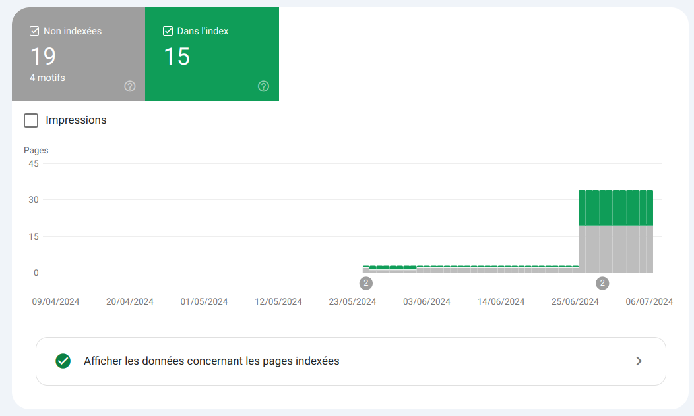
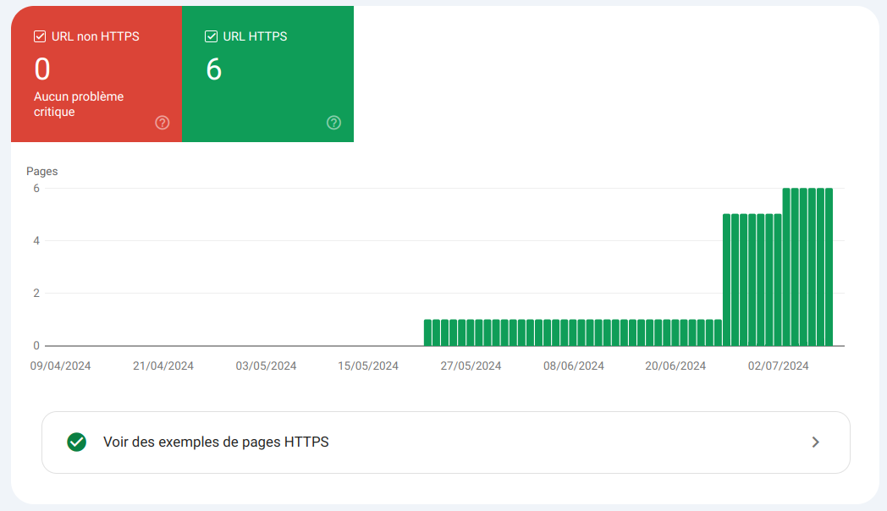
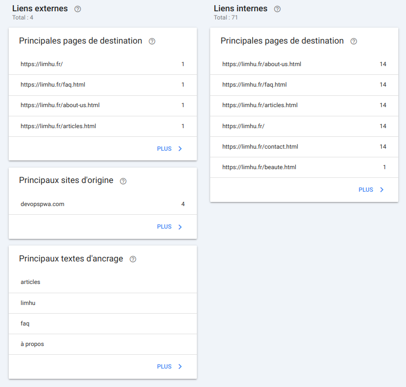
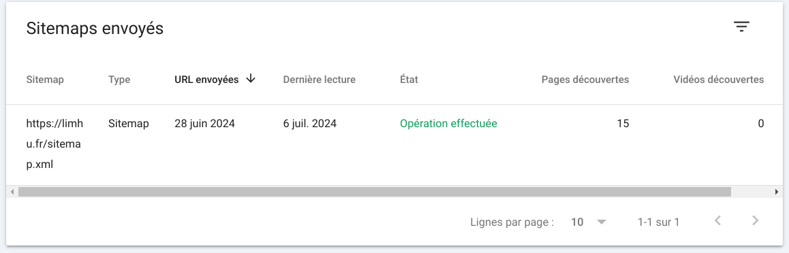
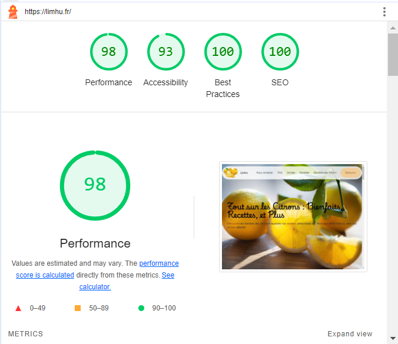
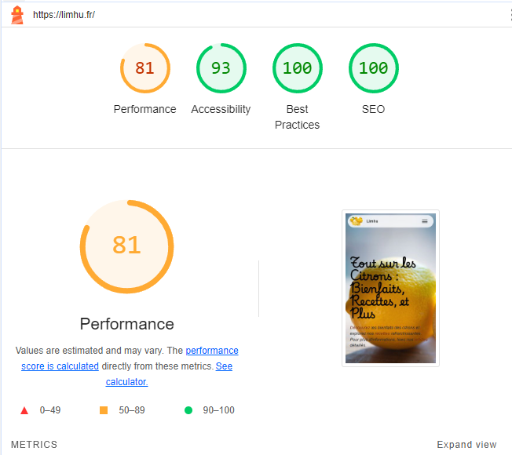
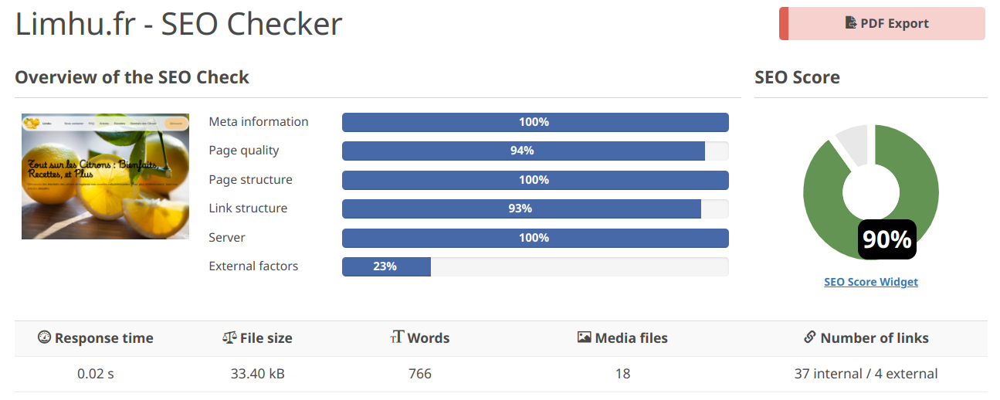
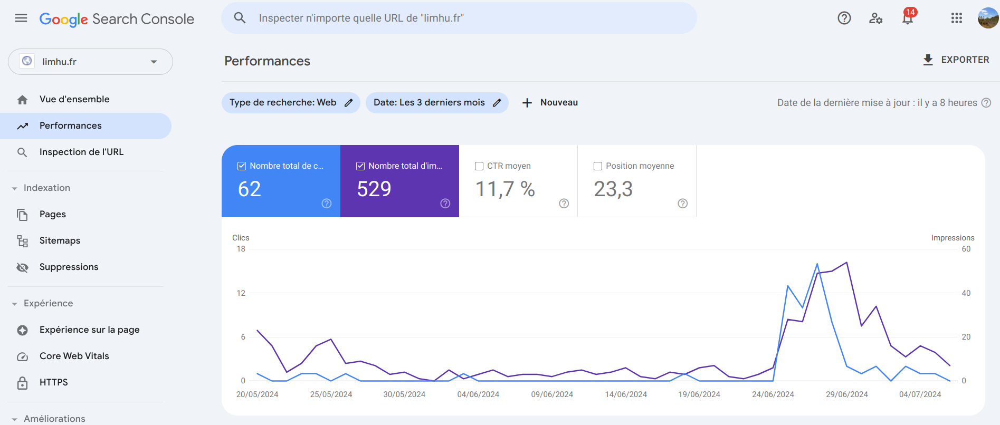

# Rapport SEO - [Limhu](https://limhu.fr)

## Actions

### Spécifications Meta

- Longueur du titre parfaite (501/580 caractères)
- Pas de mot doublon sur le titre
- Longueur de la description Meta parfaite (953/1000 pixels de longueur max)
- Pas de soucis pour accéder au site
- Lien canonique validé (https://limhu.fr)
- La longueur est correcte
- Le nom de domaine ne contient pas de caractères non-latin
- Présence d'un sitelink dans le <head>
- Présence d'une photo de recherche dans le <head>

### Qualité/Structure de page

- La page contient un nombre suffisant de mots
- Les mots-clés utilisés dans le titre de la page sont également utilisés dans le contenu de la page.
- Le contenu textuel est parfait.
- Aucun texte ou image de remplacement n'a été trouvé.
- Il n'y a pas de doublons sur le site.
- Pages accessibles via le protocole HTTPS
- La structuration des titres est parfaite (H1-H6) avec un seul H1 par page
- Le texte a été généré avec gemini, qui permet de générer des mots clés pertinents

### Config Serveur

- 3 fichiers CSS et 3 fichiers JS
- Toutes les photos sont en .webp
- Le temps de réponse est excellent (0.002 sec)
- Le site autorise la configuration Gzip pour la transmission de données compressées
- Les redirections sont correctement configurées
- Aucun X-Powered HTTP n'est renvoyé

### Structures de liens / Backlinks

- Mise en place de backlinks via des posts facebooks repartagés
- Les liens sont tous en HTTPS, faciliant la confiance avec le client
- Le nombre de liens internes est très bien

### Vérifications / Implémentations

- Utilisation de https://keywordtool.io/fr pour les mots clefs
- Utilisation de https://www.spyfu.com/ pour vérifié nos keyword
- Utilisation de https://squoosh.app/ pour réduire la taille de nos images
- Mise en place des Apple Icons et twitter cards / facebook cards afin d'avoir un aperçu du site en indiquant le lien.
- Vérification du SEO avec https://www.seobility.net/

## Stratégie

| Stratégie utilisée            | Mise en place |
|---                            |---|
| Backlinks                     | Via des posts sur les réseaux sociaux  |
| Images en webp                | Pour un temps de réponse accéléré  |
| Répétition du mot clé Limhu   | Pour augmenter notre référencement   |
| Liens internes   | Pour faciliter la navigation  |
| Mise en place d'un certificat SSL | Pour augmenter la confiance envers nos clients |
| Mots clés pertinents | Afin d'augmenter notre visibilité envers les différents sujets reliés à Limhu |
| Sitemap.xml | Pour référencer nos liens sur Google afin d'indexer les pages |
| Robots.txt | Afin d'indiquer aux crawlers de google les URL auxquelles il peut accéder. |

### Sitemap

## Scores

### Lighthouse Desktop

### Lighthouse Mobile

### Seobility

### Google Search Console

